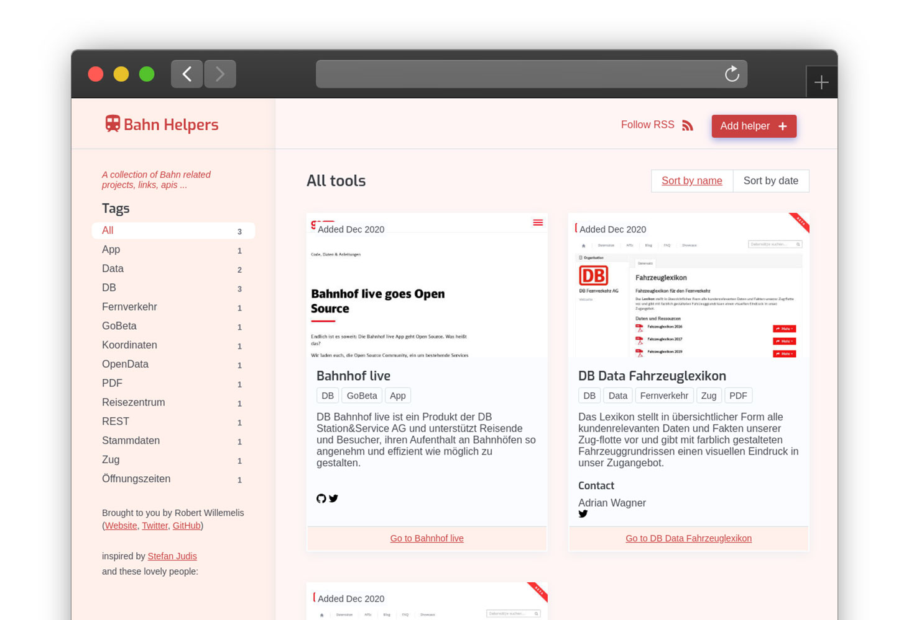

# bahn-helpers.dev

> A collection of useful tools in the train hacker area.



## Contributing

Make sure you have a recent version of [Node.js installed](https://nodejs.org/en/) (we recommend at least version `v12.14.`). After installing Node.js you'll have the `node` but also the [`npm`](https://www.npmjs.com/) command available. npm is Node.js' package manager.

**Additionally, please have a look at the [CONTRIBUTING.md](./CONTRIBUTING.md) including further information about what counts as a bahn helper.**


Fork and clone this repository. Head over to your terminal and run the following command:

```
git clone git@github.com:[YOUR_USERNAME]/tiny-helpers.git
cd tiny-helpers
npm ci
npm run projects:add
```

### Add a new helper

### simply add new json file
Under projects you find the project-name.json-files. Copy and add the information in your style
```
{
  "name": "My Project",
  "desc": "",
  "url": "my-url.org/",
  "links": {
      "github": "https://github.com/xxx"
  },
  "tags": [
    "MyTag"
  ],
  "creators": [
  ],
  "no-permission": [
  ],
  "permissions": [
  ],
  "licenses": [
      "MIT"
  ],
  "contacts": [
  ],
  "maintainers": [
  ],
  "addedAt": "2020-12-12"
}

```

### By npm
`npm run projects:add` will ask a few questions and create a file in `helpers/`.
Commit the changes and [open a pull request](https://help.github.com/en/github/collaborating-with-issues-and-pull-requests/creating-a-pull-request).

### Run the project locally

This project uses Vercel's routing configuration. The `/` route doesn't work locally. To start, navigate to `localhost:8080/home/` after running `npm run dev`.

```
npm run dev
```
## Contributors :sparkles:

Inspired by the project https://tiny-helpers.dev/ from Stefan Judis.

<table>
    <tr>
        <td align="center">
            <a href="https://github.com/stefanjudis">
                
                <br />
                <sub><b>Stefan Judis</b></sub>
            </a>
        </td>
    </tr>
</table>

